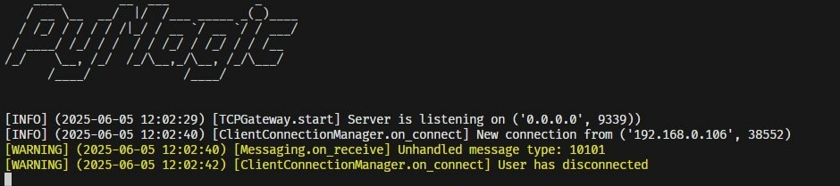

<div align="center" style="max-width: 100%; overflow-x: auto; margin: 0 auto;">
  <div style="text-align: center; padding: 0 10px; width: 100%;">
    <h1 style="font-size: clamp(24px, 5vw, 36px); margin: 0 auto;">PyMagic Core</h1>
  </div>

  <div style="display: flex; justify-content: center; margin: 20px auto; width: 100%;">
    
  </div>

  <div style="text-align: center; margin: 20px auto; width: 100%;">
    <div style="display: inline-flex; flex-wrap: wrap; justify-content: center; gap: 8px;">
      
      
    </div>
  </div>
</div>

## Overview

PySupercell Core is lightweight, fully asynchronous core for building servers for any Supercell game — written from scratch in Python.


## Installation

1. Clone the repository:

    ```bash
    git clone https://github.com/REtard-1337/pysupercell-core
    cd pysupercell-core
    ```

2. Install requirements:

    ```bash
    pip install -r requirements.txt
    ```

3. Run the server:

    ```bash
    python3 main.py
    ```
## Disclaimer  
This repository is **not affiliated** with, maintained, authorized, endorsed, or sponsored by Supercell.  
All product and company names are trademarks™ or registered® trademarks of their respective holders.  
Use of them does not imply any affiliation with or endorsement by them.  

The source code is provided for **educational purposes only**.  

## License

[MIT License](https://github.com/REtard-1337/pysupercell-core/blob/main/LICENSE)